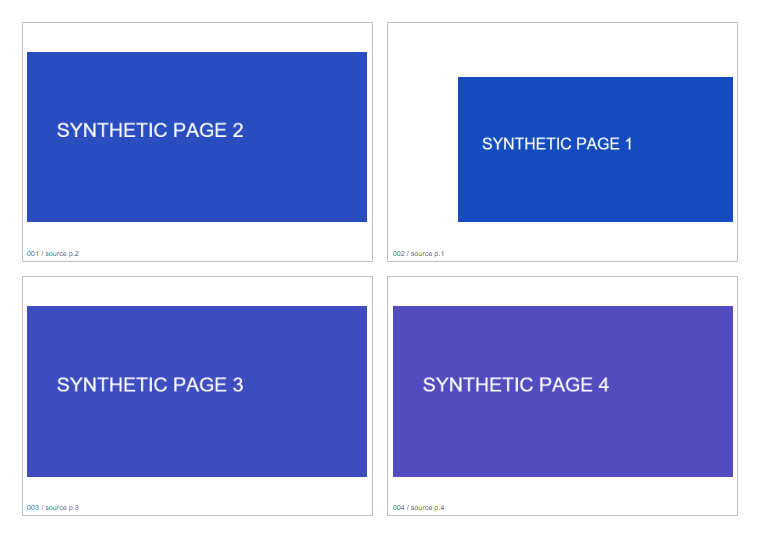

# A4 多格式排版工具 · v0.2.8

将 Word、Excel、PDF 和图片混排成 A4 打印稿的 Windows 本地工具。文件在本机完成转换与排版，不依赖外部 CDN，不改动原文件。

[下载完整 Windows 发布包](https://github.com/yin38425-byte/a4-print-composer/releases/download/v0.2.8/duoge-paiban-v0.2.8.zip) · [发布说明](https://github.com/yin38425-byte/a4-print-composer/releases/tag/v0.2.8) · [完整操作说明](使用说明.txt)

## 效果展示



*2026-09-14 验收使用的合成示例页，不含真实票据或个人文件。*

[查看对应的实际导出 PDF](验收证据/四角自由缩放_实际导出.pdf)

## 下载与启动

1. 下载上方完整 ZIP，并将整个压缩包解压到本机文件夹。
2. 双击包内的 **启动多格式排版.exe**，保留打开的本地助手窗口。
3. 助手会打开浏览器；也可复制助手显示的地址到 Chrome 或 Edge。
4. 导入文件，选择每张 A4 排 2 / 4 / 8 页及纸张方向，再调整位置、比例与顺序。
5. 下载 A4 打印稿，打印时选择对应方向和实际大小 / 100%。

**完整 Word / Excel 转换需要发布包中的专用本地助手。** `python -m http.server`、`npx serve` 等普通静态服务器不能提供 Office 转换接口，不能代替完整启动方式。也不要仅复制或双击 `index.html` 来使用办公文件转换。

发布包下载文件名为 `duoge-paiban-v0.2.8.zip`；GitHub 发布页的中文标签与该文件对应。单独的 EXE 附件是同版组件，首次使用建议下载完整 ZIP。

## 功能与限制

- **混排**：支持 Word DOC/DOCX、RTF、Excel XLS/XLSX、PDF、PNG、JPG；可一次多选或分次添加。
- **版式**：每张 A4 排 2 / 4 / 8 页，支持纵向和横向。
- **四角自由缩放**：对角固定，宽高可独立调整；按住 Shift 保持拖动开始时的比例，宽高各支持 25%–200%。
- **换序与恢复**：拖动内容跨格、跨纸交换位置；支持撤销、恢复当前内容与全部恢复。
- **导出**：下载打印稿或处理清单，查看来源页、输出位置、宽高比例与位移。
- **键盘**：方向键移动，Shift 加大步长；角点上调整宽高，`Alt + 方向键` 交换相邻页。详见完整操作说明。

运行环境与边界：

- 需要 Windows；Word / RTF 转换需要可用的桌面版 Word，Excel 转换需要桌面版 Excel。
- 保留 WPS 自动化接口作为备选，但 **v0.2.8 未完成 WPS 实机验收**。
- Excel 按现有打印区域、分页和可见工作表导入，隐藏页不排入。
- 每次最多 100 个文件、累计 100 页，单个文件 25MB。
- 调整整页的位置和比例，不在网页内编辑 Word 文字或 Excel 单元格。
- 不识别发票金额，不做发票验真；暂不支持 OFD、旋转 PDF 页、加密文件、带宏文档和外部数据连接。
- 刷新或关闭页面后，本次导入和调整不会保留，请先下载结果。
- 手机不能运行该 Windows 本地助手。

## 常见问题

| 情况 | 处理方式 |
| --- | --- |
| 页面能打开，但 Word / Excel 转换失败 | 确认使用完整发布包的启动程序，本地助手窗口仍在运行；检查对应桌面版 Office 是否可用 |
| 下载到一个 ZIP，不知道打开哪个文件 | 完整解压后运行包内“启动多格式排版.exe”，无需单独下载另外两个 EXE |
| Excel 导入内容缺失或分页不合预期 | 先在 Excel 检查打印区域、打印预览和工作表可见性，再重新导入 |
| 放大后部分内容不见了 | 超出格子的部分会被裁切，可调整比例与位置，并检查导出的 PDF |
| 程序或助手窗口报错 | 保留具体错误信息；不要把“静态网页可打开”等同于 Office 转换可用 |

## 本人贡献与 AI 协作

本人负责使用需求、版式与交互取舍、体验反馈及验收，主要工程实现由 Codex 协作完成。该项目展示的是 **产品需求定义＋AI 协作开发**。

## 验证记录

仓库保留的 **2026-09-14 历史验收记录**覆盖：

- 1152 组自由 / Shift 缩放与 240 组固定对角检查；
- Chrome 鼠标和键盘交互；
- 6 份实际导出 PDF 的 36 处内容绘制矩阵比对；
- 原有状态、换序、连续添加、空白页和版式回归。

以上是 v0.2.8 当时的验收记录，不表示每次文档更新都重新执行了完整测试。本仓库保留记录、样例与摘要，未附带全部开发测试脚本。

[四角自由缩放验收记录](验收证据/四角自由缩放记录.md) · [验证结果](验收证据/验证结果.json)

历史环境为 Microsoft Word / Excel 16.0 与 Chrome，不声称覆盖所有浏览器、WPS 版本或实体打印设备。

## 仓库结构

```text
index.html       网页主程序，部分依赖已内联
使用说明.txt      完整操作说明
assets/pdfjs/    PDF.js 运行资源、字符映射与字体
第三方许可说明/   第三方库的许可证与版权说明
验收证据/        验证记录、示例 PDF、预览图与结果摘要
```

完整 Windows 启动程序和转换助手位于 [Releases](https://github.com/yin38425-byte/a4-print-composer/releases)，不在当前仓库文件目录中。

## 第三方许可

第三方库的许可证与版权声明保留在 [第三方许可说明](第三方许可说明/) 及 `assets/pdfjs/` 的相关许可文件中，请以各组件随附文件为准。
